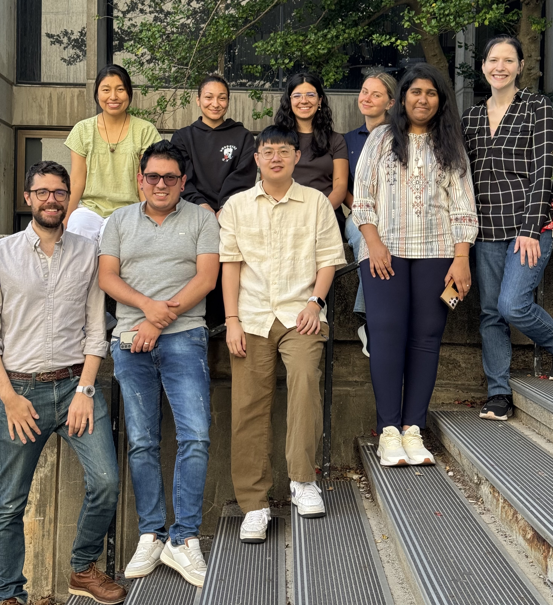
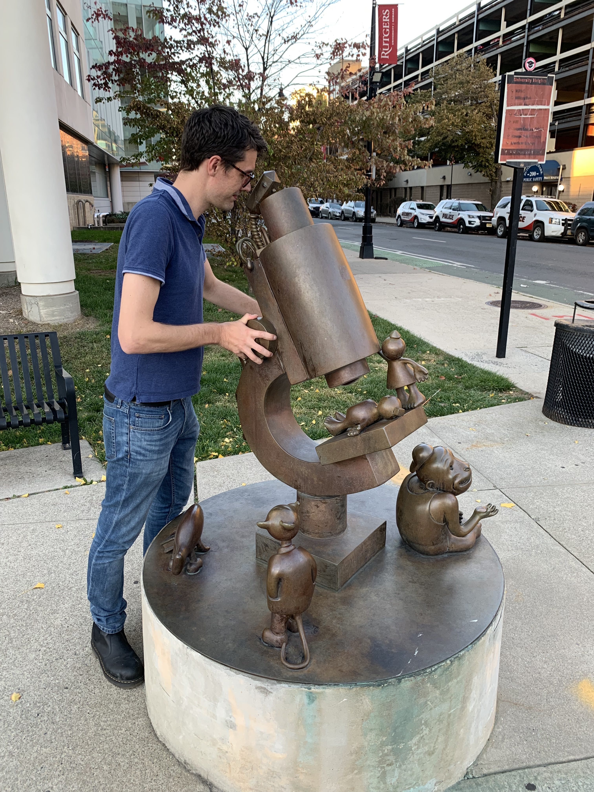
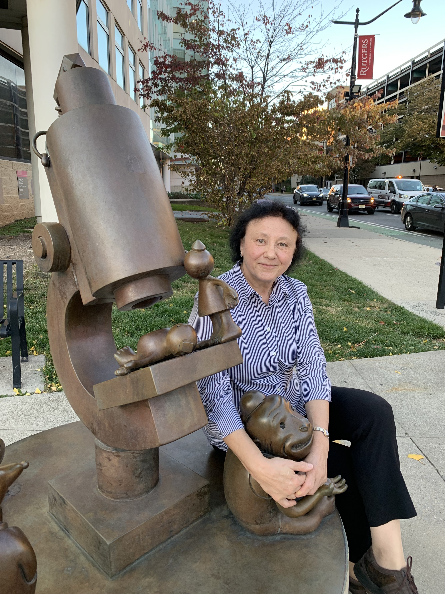
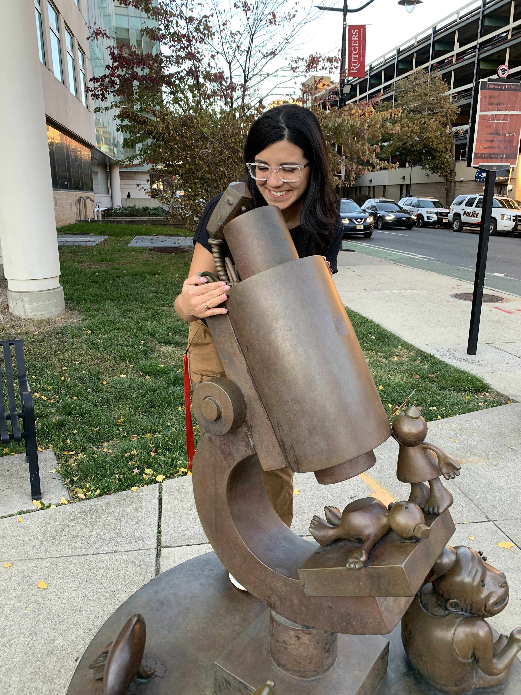
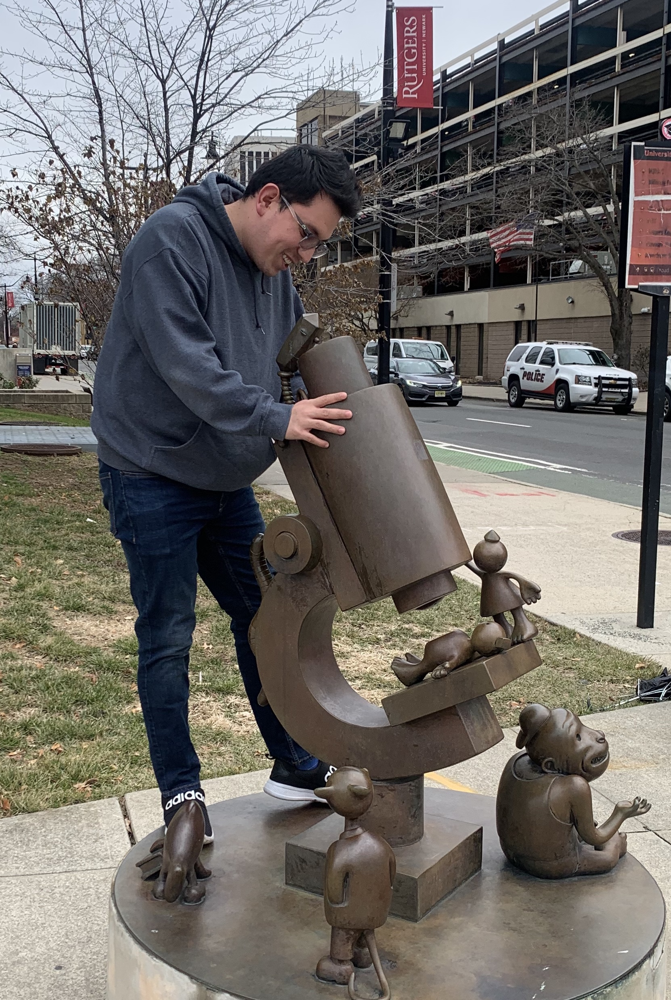
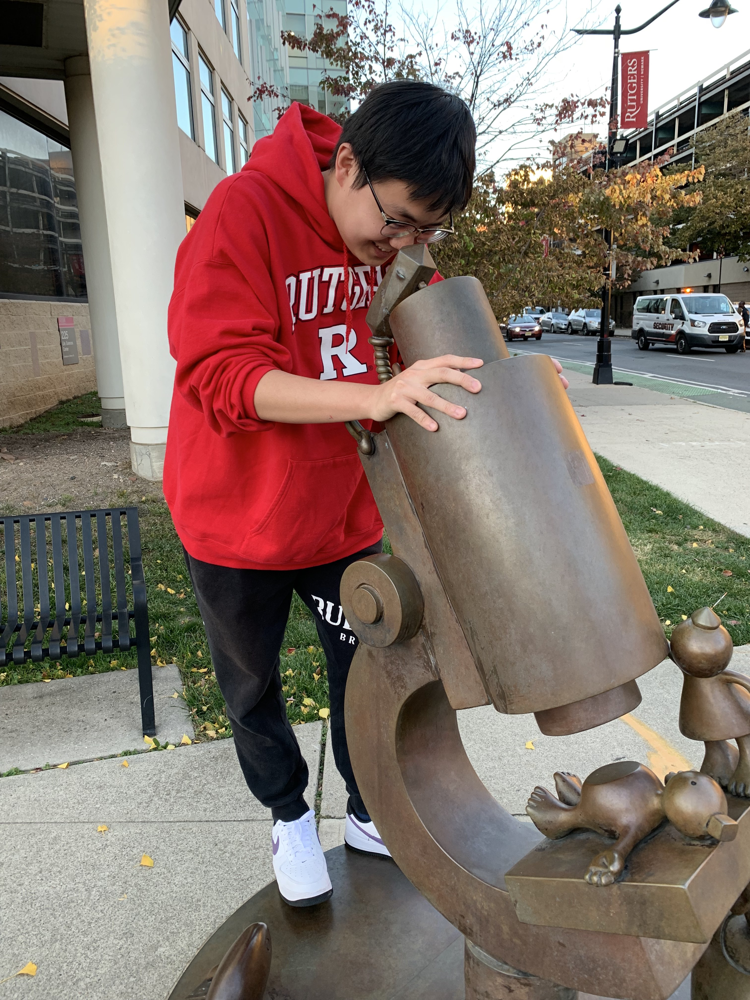
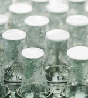
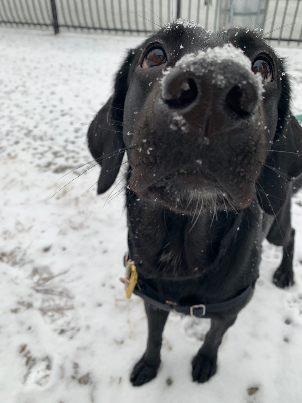
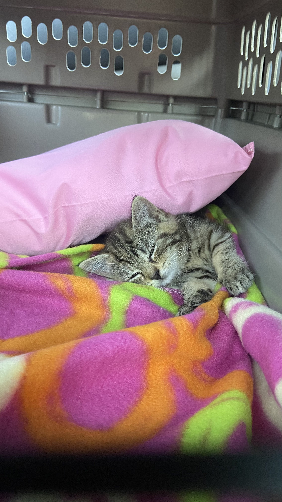

Meet the Labbies and Crabbies

### Principal Investigator
:::: {layout="[ 35, 65 ]"}

::: {center}
Prof. Colin Kinz-Thompson

[{width=0.25in}](mailto:colin.kinzthompson@rutgers.edu)
[{width=0.25in}]("./labwebsite/papers/CV_CKT.pdf")
:::
::::

### Research Scientists
:::: {layout="[ 35, 65 ]"}

::: {center}
Dr. Natalia Nemeria

Research Associate

[{width=0.25in}](mailto:nemeria@newark.rutgers.edu)
<!-- Start: Summer 2022  -->
<!-- End: Current -->
:::
::::

### Graduate Students

:::: {layout="[ 35, 65 ]"}

::: {center}
Katherine Leon Hernandez

SREB Doctoral Scholar, NIH MBRS Scholar, NSF GS-LSAMP B2D Scholar

[{width=0.25in}](mailto:kathy.leon@rutgers.edu)
<!-- Start: Fall 2020  -->
<!-- End: Current -->
:::
::::

:::: {layout="[ 35, 65 ]"}

::: {center}
Andres Cifuentes

[{width=0.25in}](mailto:acc256@scarletmail.rutgers.edu)
<!-- Start: Spring 2023  -->
<!-- End: Current -->
:::
::::

:::: {layout="[ 35, 65 ]"}

::: {center}
Tianyue Dai

[{width=0.25in}](mailto:td460@newark.rutgers.edu)
<!-- Start: Fall 2022  -->
<!-- End: Current -->
:::
::::

:::: {layout="[ 35, 65 ]"}

::: {center}
Christa Murphy

[{width=0.25in}](mailto:mailto:cm1669@scarletmail.rutgers.edu)
<!-- Start: Spring 2024  -->
<!-- End: Current -->
:::
::::

### Undergraduate Researchers

:::: {layout="[ 35, 65 ]"}

::: {center}
Jessica Heaney

<!-- Start: Summer 2025  -->
<!-- End: Current -->
:::
::::

:::: {layout="[ 35, 65 ]"}

::: {center}
Jared De La Rosa 
<!-- Job: SGS (Société Générale de Surveillance, SA) -->
<!-- Start: Spring 2026  -->
<!-- End: Summer 2026 -->
:::
::::

### Past Members

###### Graduate Students
* Vaishnavi Shesham, Fall 2022 - Summer 2025,  vs803@scarletmail.rutgers.edu
* Zhutao Sheng, Fall 2022 - Fall 2024, zhutao.sheng@rutgers.edu
* Yuntao Qiu, Spring 2021 - Summer 2022, yq123@scarletmail.rutgers.edu, [CUNY Graduate Center Biochemistry Program]

###### Undergraduate Students
* Katrina Mejia, Spring 2024-Fall 2025, km722@scarletmail.rutgers.edu, NSF GS-LSAMP Scholar, [Nanion Technologies]
* Olena Hryvnak, Summer 2025, oh87@scarletmail.rutgers.edu, [Rutgers New Brunswick]
* Karl Gaiser, Spring 2023-Summer 2025, kcg5@njit.edu, [Tufts University Chemistry Department]
* Jordania (Jordi) Urquizo, Spring 2024 & Summer 2025, jju20@scarletmail.rutgers.edu, McNair Scholar
* Brigitte Valladares, Summer 2024, Bsvalladares@students.pccc.edu, NSF GS-LSAMP B2B Scholar
* Kaiyang Zhu, Summer 2023, kaiyang.zhu@emory.edu
* Wesley Chan, Spring 2022 - Summer 2022, wc518@scarletmail.rutgers.edu

###### High School Students
* Sasche Joseph, Summer 2022, ACS Project SEED Student

### Pets

:::: {layout="[ 35, 65 ]"}

::: {}
Onyx

Lab(rador retriever)

:::
::::

:::: {layout="[ 35, 65 ]"}

::: {}
Cilantra

Cat(ion exchange chromatography resin)

:::
::::
